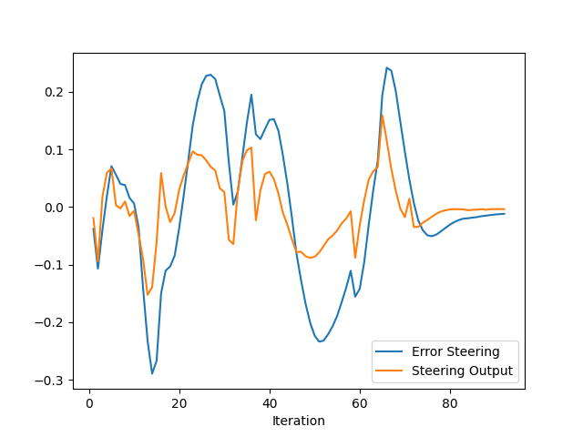
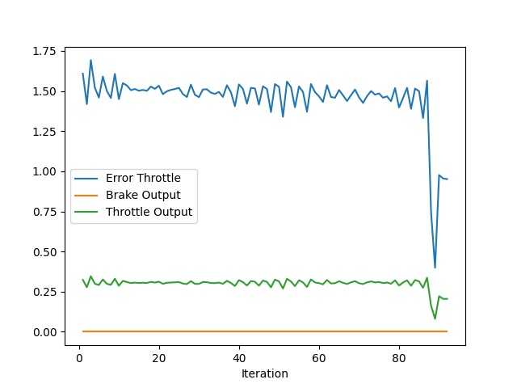

# Control and Trajectory Tracking for Autonomous Vehicle

# Proportional-Integral-Derivative (PID)

In this project, you will apply the skills you have acquired in this course to design a PID controller to perform vehicle trajectory tracking. Given a trajectory as an array of locations, and a simulation environment, you will design and code a PID controller and test its efficiency on the CARLA simulator used in the industry.

### Installation

Run the following commands to install the starter code in the Udacity Workspace:

Clone the <a href="https://github.com/udacity/nd013-c6-control-starter/tree/master" target="_blank">repository</a>:

`git clone https://github.com/udacity/nd013-c6-control-starter.git`

## Run Carla Simulator

Open new window

* `su - student`
// Will say permission denied, ignore and continue
* `cd /opt/carla-simulator/`
* `SDL_VIDEODRIVER=offscreen ./CarlaUE4.sh -opengl`

## Compile and Run the Controller

Open new window

* `cd nd013-c6-control-starter/project`
* `./install-ubuntu.sh`
* `cd pid_controller/`
* `rm -rf rpclib`
* `git clone https://github.com/rpclib/rpclib.git`
* `cmake .`
* `make` (This last command compiles your c++ code, run it after every change in your code)

## Testing

To test your installation run the following commands.

* `cd nd013-c6-control-starter/project`
* `./run_main_pid.sh`
This will silently fail `ctrl + C` to stop
* `./run_main_pid.sh` (again)
Go to desktop mode to see CARLA

If error bind is already in use, or address already being used

* `ps -aux | grep carla`
* `kill id`


## Project Instructions

In the previous project you built a path planner for the autonomous vehicle. Now you will build the steer and throttle controller so that the car follows the trajectory.

You will design and run the a PID controller as described in the previous course.

In the directory [/pid_controller](https://github.com/udacity/nd013-c6-control-starter/tree/mathilde/project_c6/project/pid_controller)  you will find the files [pid.cpp](https://github.com/udacity/nd013-c6-control-starter/tree/mathilde/project_c6/project/pid_controller/pid.cpp)  and [pid.h](https://github.com/udacity/nd013-c6-control-starter/tree/mathilde/project_c6/project/pid_controller/pid.h). This is where you will code your pid controller.
The function pid is called in [main.cpp](https://github.com/udacity/nd013-c6-control-starter/tree/mathilde/project_c6/project/pid_controller/main.cpp).

### Step 1: Build the PID controller object
Complete the TODO in the [pid_controller.h](https://github.com/udacity/nd013-c6-control-starter/tree/mathilde/project_c6/project/pid_controller/pid_controller.h) and [pid_controller.cpp](https://github.com/udacity/nd013-c6-control-starter/tree/mathilde/project_c6/project/pid_controller/pid_controller.cpp).

Run the simulator and see in the desktop mode the car in the CARLA simulator. Take a screenshot and add it to your report. The car should not move in the simulation.
### Step 2: PID controller for throttle:
1) In [main.cpp](https://github.com/udacity/nd013-c6-control-starter/tree/mathilde/project_c6/project/pid_controller/main.cpp), complete the TODO (step 2) to compute the error for the throttle pid. The error is the speed difference between the actual speed and the desired speed.

Useful variables:
- The last point of **v_points** vector contains the velocity computed by the path planner.
- **velocity** contains the actual velocity.
- The output of the controller should be inside [-1, 1].

2) Comment your code to explain why did you computed the error this way.

3) Tune the parameters of the pid until you get satisfying results (a perfect trajectory is not expected).

### Step 3: PID controller for steer:
1) In [main.cpp](https://github.com/udacity/nd013-c6-control-starter/tree/mathilde/project_c6/project/pid_controller/main.cpp), complete the TODO (step 3) to compute the error for the steer pid. The error is the angle difference between the actual steer and the desired steer to reach the planned position.

Useful variables:
- The variable **y_points** and **x_point** gives the desired trajectory planned by the path_planner.
- **yaw** gives the actual rotational angle of the car.
- The output of the controller should be inside [-1.2, 1.2].
- If needed, the position of the car is stored in the variables **x_position**, **y_position** and **z_position**

2) Comment your code to explain why did you computed the error this way.

3) Tune the parameters of the pid until you get satisfying results (a perfect trajectory is not expected).

### Step 4: Evaluate the PID efficiency
The values of the error and the pid command are saved in thottle_data.txt and steer_data.txt.
Plot the saved values using the command (in nd013-c6-control-refresh/project):

```
python3 plot_pid.py
```

You might need to install a few additional python modules: 

```
pip3 install pandas
pip3 install matplotlib
```

Answer the following questions:
- Add the plots to your report and explain them (describe what you see)

The first figure is related to the steering error and steering output. The error curve shows a low frequency oscillation. Oscilation implies that there are still at least one pair complex conjugate eigen values in the closed loop transfer function, while low frequency means the trajectory is rekatively smooth. 


The second figure is about the velocity control. The intended speed in the disired trajectory is 3 m/s nearly everywhere, which brings about many difficulties in the project. First, in the urban surroundings, this speed is hard to reach especially to avoid the collisions. Second, to control the control of yaw angle is significnatly influenced by the current vehicle speed, and at the same time, at the beginning of the simulation, the speed vehicle is zero which means the speed of the underly vehicle has a very large range. Hence, the PID parameter in this case is hard to determine. One solution to this kind of problem might be gain scheduling.





- What is the effect of the PID according to the plots, how each part of the PID affects the control command?
P: propotional part, provide a basic output from control. The input of the controller is always the error between the disried value and the feedback value (usually output of the whole system).
D: derivative part, it usually makes the plant have a faster reaction on the external input. In the control theory it brings about one zero in the open loop transfer function, which makes the system have a better phase gain meaning that the stability can be improved. However, due to the mathematical property of the derivatives, the high frequency contained in the process noises are augmented.
I: Integral part, which is often introduced to eliminate the static error. 

- How would you design a way to automatically tune the PID parameters?
For instance, using the twiddle algorithm introduced in the lesson, or use the gradient method in the framework of a classic optimization problem.

- PID controller is a model free controller, i.e. it does not use a model of the car. Could you explain the pros and cons of this type of controller?
PID controller is the most robust controller It has a very long history (over hundres years), but is even still widely used in today's industrial control systems and a variety of other applications requiring continuously modulated control. 

Compared to many advanced state-space control methods, which require the exact description of the system, the PID parameters are hard to tune, and the results may be far from satisfactory without considering too many external disturbances.

Usually we are not required to know the parameter of the modells when using this method. However, if we identify the parameter of the plant, like the zeros and the poles of the open loop system, we are also able to design a very high performance closed loop system.


- (Optional) What would you do to improve the PID controller?

Using Gain-Scheduling.


